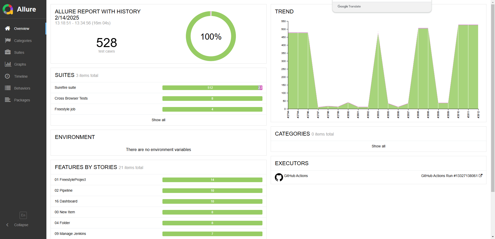

# JenkinsQA_2024_fall
<p align="center">
    
    
    
    
    
    
</p>
<h1 align="center">Project for Testing the CI/CD Tool Jenkins</h1>
<p align="center">
  
</p>

> Jenkins is an automation tool designed for Continuous Integration (CI) and Continuous Deployment (CD). It allows automatic execution of build, testing, and deployment processes whenever code changes are made in the repository.

##  Content:

- <a href="#cases"> Test documentation</a>
- <a href="#settings"> Settings</a>
- <a href="#autotests"> Running Tests Locally</a>
- <a href="#allureReport"> Allure Report Example</a>
- <a href="#tg"> Telegram Bot Notification</a>

## Tech Stack

<p align="center">
  
  
  
  
  
  
  
  
  
  
</p>

____
<a id="cases"></a>
## ️ Test documentation

- [📊 Feature Matrix](https://docs.google.com/spreadsheets/d/11v5GXk0FmRQh8te88jC_ygIHz88kpFgUvTIgDxOT1ZY/edit?gid=1912652394)
- [📋 Project Board](https://github.com/orgs/RedRoverSchool/projects/3)

____
<a id="settings"></a>
## ️ Settings

To configure the project locally, follow these steps:

1. **Run Jenkins locally**
    - Install and start Jenkins on your machine.
    - Ensure all required plugins are installed.

2. **Configure the settings file**
    - Copy `local.properties.TEMPLATE`.
    - Rename it to `local.properties` (remove `TEMPLATE`).
    - Fill in the necessary values with your local configuration.

After completing these steps, your project should be ready to use! 🚀

____
<a id="autotests"></a>
## Running Tests Locally

To run automated tests locally, use the following commands:

1. **Run all tests:**
      - ```mvn test```

2. **Run specific tests:**
      - ```mvn test -Dtest=TestName```

3. **Run a specific test suite:**
      - ```mvn clean test -Dsurefire.suiteXmlFiles=suite/<suite-name>```
      Replace <suite-name> with the actual suite file name.

4. **Run tests in a Docker Container:**
   - Using Dockerfile
     - **Build the Docker image:**
     `docker build -t img-fall-2024 .`
     `-t img-fall-2024` – assigns a name to the image.
     `.` (dot) – specifies that the image is built from the current directory.
     - **Run the container:**
     `docker run --rm --name my-container img-fall-2024` 
     `--rm` – removes the container after execution.
     `--name my-container` – assigns a name to the container.
     `img-fall-2024` – specifies the image to use for the container.
   - Using Docker Compose
     - **Start the container:**
     `docker-compose up `
     `-d` – runs the containers in the background.
     - **Stop and remove the container:**
     `docker-compose down`
This method automatically handles image mounting and container execution. 🚀

____
<a id="allureReport"></a>
##  Allure Report Example

Example of the [Allure Report](https://redroverschool.github.io/JenkinsQA_2024_fall/2812/)

<p align="center">
  
</p>

____
<a id="tg"></a>
##  Telegram Bot Notification

After the build is completed, a bot created in <code>Telegram</code> automatically processes the results and sends a message with the test run report to a [specially configured chat](https://t.me/team_jenkins_2024_fall).

<div style="background-color: #18222d">
<p align="center">

</p>
</div>
